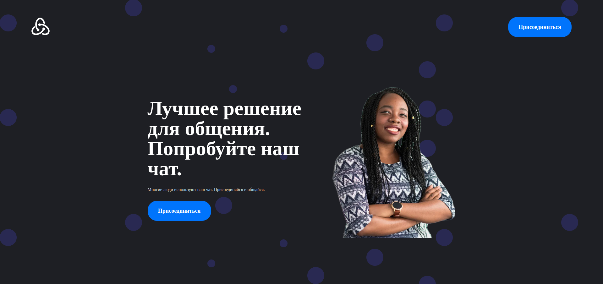
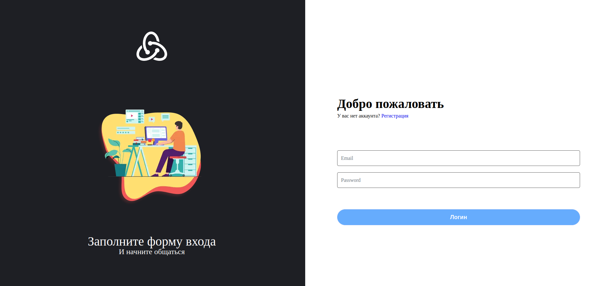
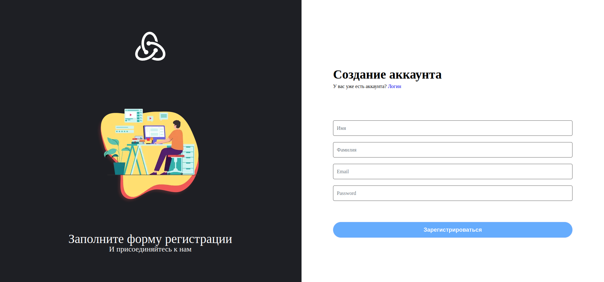
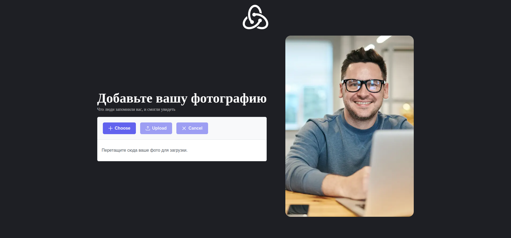
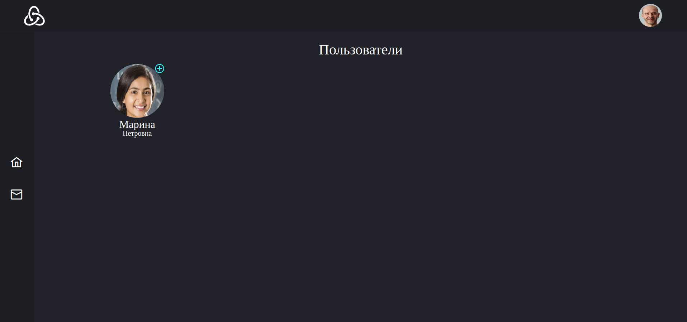
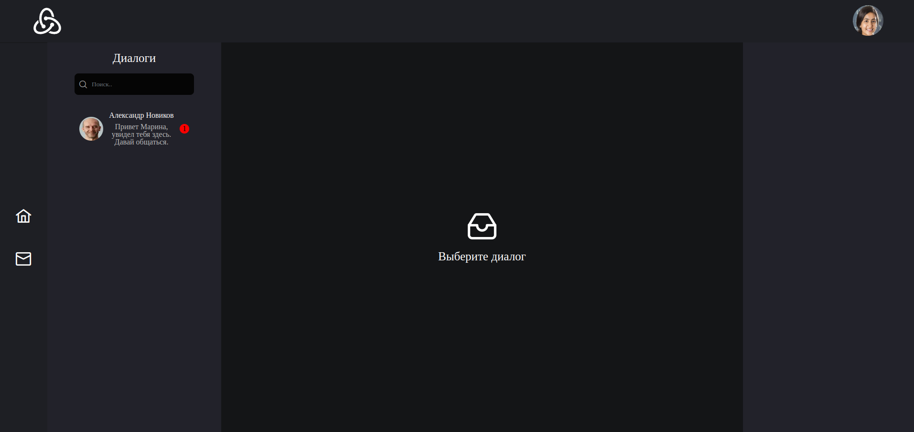
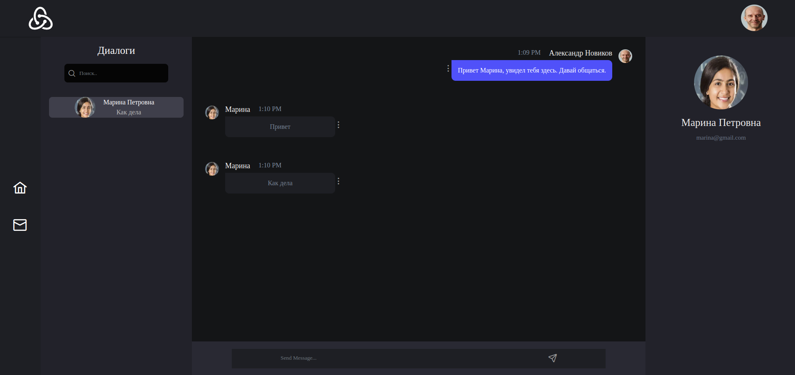

This is a [Next.js](https://nextjs.org/) project bootstrapped with [`create-next-app`](https://github.com/vercel/next.js/tree/canary/packages/create-next-app).

## Getting Started

```bash
npm run build
npm start
```

Open [http://localhost:3000](http://localhost:3000) with your browser to see the result.

## Project Photos








